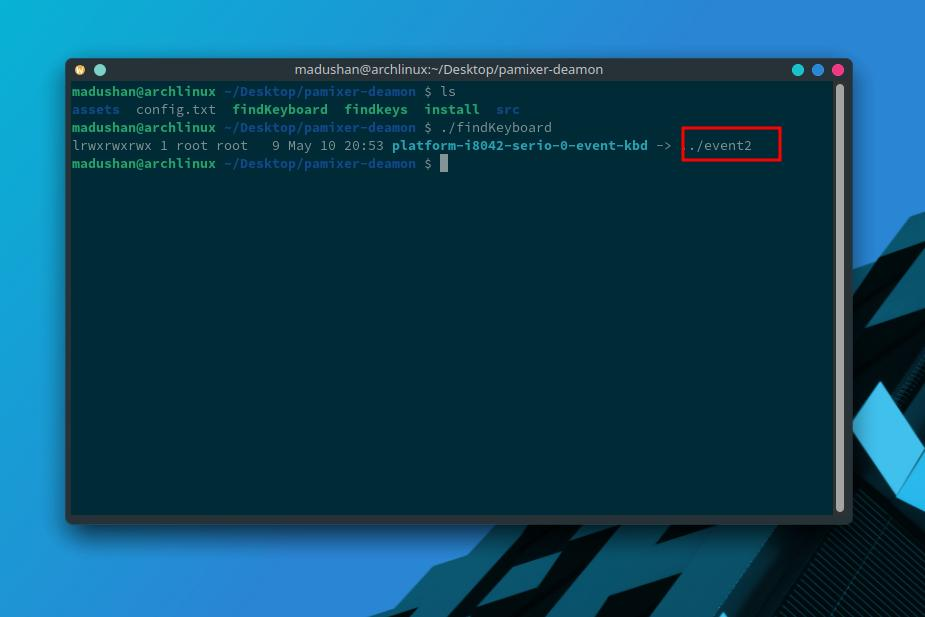
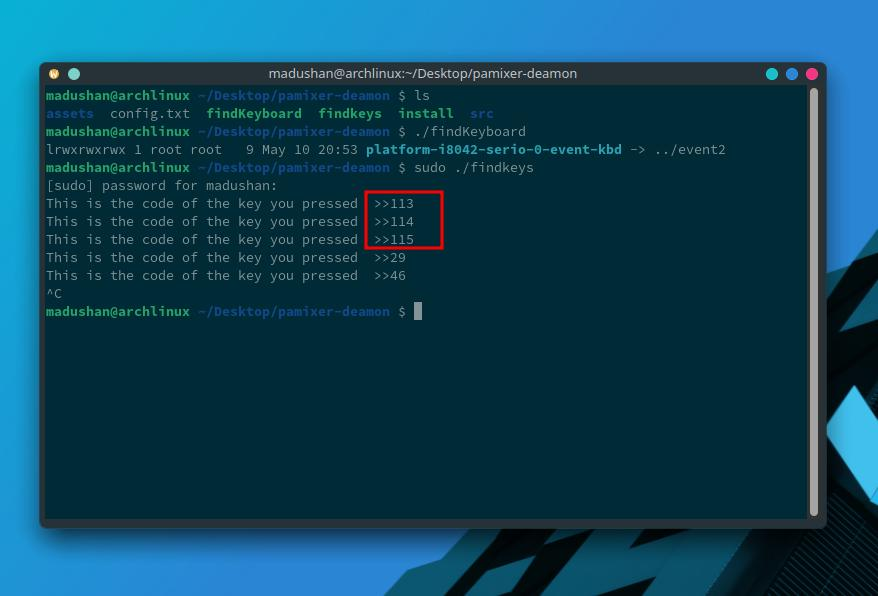
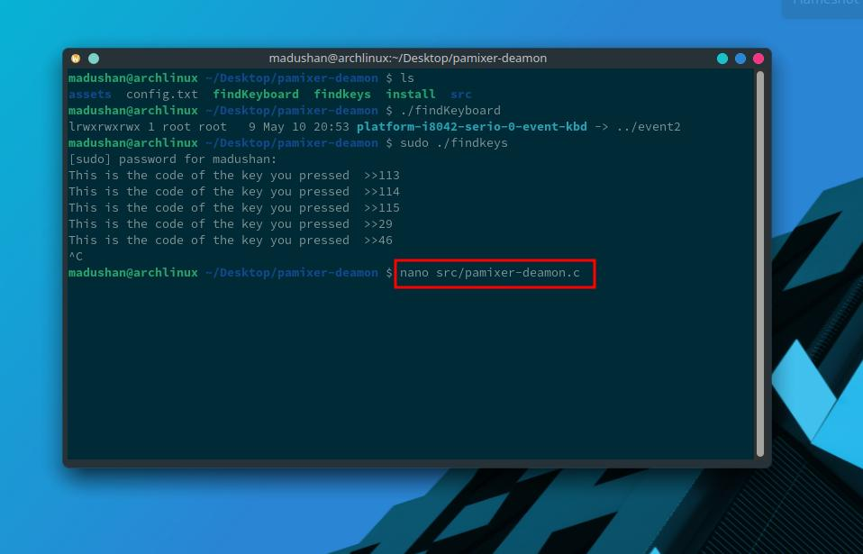
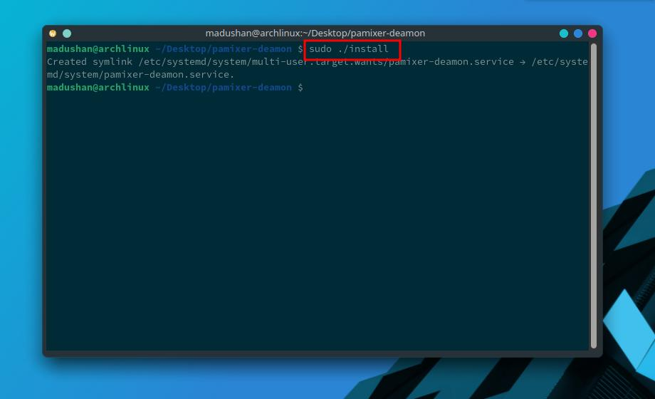

## Pamixer-deamon for pulse audio 
This is simple tool  for pulse audio control on the function keys . You can easily install on your computer . This tool not only for function keys it can use any keys in your computer . All you have to do is follow instruction .

- **findKeyboard** is simple shell script for find keyboard event 

    ./findKeyboard
    

   
-  Afterthat you must edit **config.txt** file 

    nano config.txt
    

- This executeable file find youre function key code . 

    sudo  ./findkeys

- Then you need to edit **src/pamixer-deamon.c** file and replace key code before you got values.

    nano src/pamixer-demon.c

- After you run **install** shell script . Thats all

    sudo ./install
    

   

`    

 
